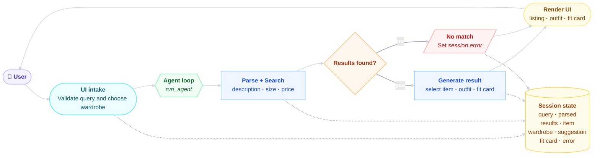

# FitFindr — planning.md

> Complete this document before writing any implementation code.
> Your spec and agent diagram are what you'll use to direct AI tools (Claude, Copilot, etc.) to generate your implementation — the more specific they are, the more useful the generated code will be.
> Your planning.md will be reviewed as part of your submission.
> Update it before starting any stretch features.

---

## Tools

List every tool your agent will use. For each tool, fill in all four fields.
You must have at least 3 tools. The three required tools are listed — add any additional tools below them.

### Tool 1: search_listings

**What it does:**
<!-- Describe what this tool does in 1–2 sentences -->
Pure-Python (no LLM) search over the 40 mock listings. Loads all listings, filters by optional size and price ceiling, scores the rest by keyword overlap against the description, drops anything that doesn't match, and returns the survivors ranked best-first.

**Input parameters:**
<!-- List each parameter, its type, and what it represents -->
- `description` (str): Keywords describing the wanted item. Drives the relevance scoring.
- `size` (str): Size to filter by; `None` skips size filtering. Match is case-insensitive.
- `max_price` (float): Inclusive price ceiling; `None` skips price filtering.

**What it returns:**
<!-- Describe the return value — what fields does a result contain? -->
`list[dict]`, matching listing dictionaries sorted by score (highest first). Each dictionary has: `id, title, description, category, style_tags (list), size, condition, price (float), colors (list), brand, platform`. Returns an empty list when nothing matches.

**What happens if it fails or returns nothing:**
<!-- What should the agent do if no listings match? -->
Never raises on "no match", it returns `[]`. The agent loop must detect the empty list, set `session["error"]` to a helpful message, and stop early (do not call `suggest_outfit` with empty input).

---

### Tool 2: suggest_outfit

**What it does:**
<!-- Describe what this tool does in 1–2 sentences -->
LLM-backed (Groq). Given a thrifted item and the user's wardrobe, suggests 1 to 2 complete outfits. Branches on whether the wardrobe has items: if populated, it asks the LLM to combine the new item with named pieces from the wardrobe; if empty, it asks for general styling advice instead.

**Input parameters:**
<!-- List each parameter, its type, and what it represents -->
- `new_item` (dict): A listing dictionary (the item being considered), typically `session["selected_item"]`, the top search result.
- `wardrobe` (dict): Wardrobe dictionary with an `'items'` key (list of wardrobe-item dictionaries). May be empty, must be handled gracefully.

**What it returns:**
<!-- Describe the return value -->
A  non-empty `str` of outfit suggestions. For an empty wardrobe it returns general styling ideas (vibe, what pairs well) rather than specific combos.

**What happens if it fails or returns nothing:**
<!-- What should the agent do if the wardrobe is empty or no outfit can be suggested? -->
The "failure" mode here is an empty wardrobe, which is treated as a normal branch, not an error, it must still return a useful non-empty string (general advice) rather than raising or returning `""`. Since this tool only runs after `search_listings` produced a result, it always receives a valid `new_item`.

---

### Tool 3: create_fit_card

**What it does:**
<!-- Describe what this tool does in 1–2 sentences -->
LLM-backed (Groq), run at a higher temperature for variety. Turns the outfit suggestion into a short, shareable OOTD-style social caption ("fit card"). The caption should feel casual/authentic, mention the item name, price, and platform once each, capture the outfit vibe, and read differently for different inputs.

**Input parameters:**
<!-- List each parameter, its type, and what it represents -->
- `outfit` (...): The outfit-suggestion string returned by `suggest_outfit()`.

**What it returns:**
<!-- Describe the return value -->
A `str` of 2 to 4 sentences usable as an Instagram/TikTok caption.

**What happens if it fails or returns nothing:**
<!-- What should the agent do if the outfit data is incomplete? -->
Must guard against an empty or whitespace-only `outfit`. In that case it returns a descriptive error-message string, it does not raise an exception. (In the normal chained flow this won't trigger, since `suggest_outfit` is contracted to return non-empty text.)

---

### Additional Tools (if any)

<!-- Copy the block above for any tools beyond the required three -->

---

## Planning Loop

**How does your agent decide which tool to call next?**
<!-- Describe the logic your planning loop uses. What does it look at? What conditions change its behavior? How does it know when it's done? -->
In the build state, a single session dictionary contains all necessary information. The first step is to parse the query into its components: `description`, `size`, and `max_ price`. This leads to the search, which acts as the gateway to finding results. 

Next, a decision must be made. If there are no results, the session's "error" key is set, and the process returns immediately. In this case, Tools 2 and 3 will not run, and both `outfit_suggestion` and `fit_card` remain as `None`. On the other hand, if results do exist, the process continues.

The top result, which is the first entry in `search_results`, is selected to suggest an outfit. Following this, a fit card is created in a straight-line manner, without any conditions, as each step consumes the output of the previous step. Finally, the session is returned with the error still set to None.

---

## State Management

**How does information from one tool get passed to the next?**
<!-- Describe how your agent stores and accesses state within a session. What data is tracked? How is it passed between tool calls? -->
Everything flows through one mutable `session` dictionary created by `_new_session()`. There's no return-value-to-argument chaining between tools directly, instead, each tool's output is written into a session field, and the next tool reads from that field. The session is the single source of truth.

---

## Error Handling

For each tool, describe the specific failure mode you're handling and what the agent does in response.

| Tool | Failure mode | Agent response |
|------|-------------|----------------|
| search_listings | No results match the query | The loop sets `session["error"]` to a helpful "no matches" message and returns early. `suggest_outfit` and `create_fit_card` never run, `outfit_suggestion` and `fit_card` stay `None`. The UI shows the error message. |
| suggest_outfit | Wardrobe is empty | Not treated as an error. It calls the LLM for general styling advice for the item instead of specific wardrobe combos, and returns that non-empty string. |
| create_fit_card | Outfit input is missing or incomplete | Guards against the empty/whitespace outfit and returns a descriptive error-message string (no exception raised). |

---

## Architecture

<!-- Draw a diagram of your agent showing how the components connect:
     User input → Planning Loop → Tools (search_listings, suggest_outfit, create_fit_card)
                                                                          ↕
                                                                   State / Session
     Show what triggers each tool, how state flows between them, and where error paths branch off.
     ASCII art, a Mermaid diagram (https://mermaid.js.org/syntax/flowchart.html), or an embedded
     sketch are all fine. You'll share this diagram with an AI tool when asking it to implement
     the planning loop and each individual tool. -->

---

## AI Tool Plan

<!-- For each part of the implementation below, describe:
     - Which AI tool you plan to use (Claude, Copilot, ChatGPT, etc.)
     - What you'll give it as input (which sections of this planning.md, your agent diagram)
     - What you expect it to produce
     - How you'll verify the output matches your spec before moving on

     "I'll use AI to help me code" is not a plan.
     "I'll give Claude my Tool 1 spec (inputs, return value, failure mode) and ask it to implement
     search_listings() using load_listings() from the data loader — then test it against 3 queries
     before trusting it" is a plan. -->

**Milestone 3 — Individual tool implementations:**
For each tool, I will use Claude and feed it a description of the function, its parameters, the expected return value, and its behavior in the event of input errors. I expect it to generate functional code, and I will verify the output using pytest with the appropriate function calls.

**Milestone 4 — Planning loop and state management:**
I will utilize Claude to assist me in implementing `agent.py` and `app.py`. After that, I will write another pytest to ensure that the agent responds differently to various inputs, confirming that it does not execute the same sequence each time.

---

## A Complete Interaction (Step by Step)

Write out what a full user interaction looks like from start to finish — tool call by tool call. Use a specific example query.

**Example user query:** "I'm looking for a vintage graphic tee under $30. I mostly wear baggy jeans and chunky sneakers. What's out there and how would I style it?"

**Step 1:**
<!-- What does the agent do first? Which tool is called? With what input? -->
First, the agent creates a session dictionary. The tool, called `search_listings()`, parses the query parameters {description, size, max_price} as input.

**Step 2:**
<!-- What happens next? What was returned from step 1? What tool is called now? -->
Transition to the next state `session["search_results"]`, which returned `selected_item`. This will suggest how to style it with clothes the user already owns by triggering the tool `suggest_outfit()`.

**Step 3:**
<!-- Continue until the full interaction is complete -->
Transition to the next state, `session["outfit_suggestion"]`, to trigger the tool `create_fit_card()`. This will generate a casual caption consisting of 2 to 4 sentences that includes the item name, price, and platform. This caption will then be delivered in the final transition to the last state's `session["fit_card"]`.

**Final output to user:**
<!-- What does the user actually see at the end? --> "Just scored this sick Graphic Tee — 2003 Tour Bootleg Style for $24 on Depop, and I'm absolutely obsessed! 🖤✨ It adds the perfect grunge touch to my outfits. I've been rocking it with baggy straight-leg jeans and black combat boots for an edgy vibe, plus it pairs surprisingly well with wide-leg khaki trousers and chunky white sneakers for that streetwear look. Who knew vintage could be so versatile? 😍🤘 #OOTD #DepopFind #GraphicTee #VintageVibes #Streetwear "
